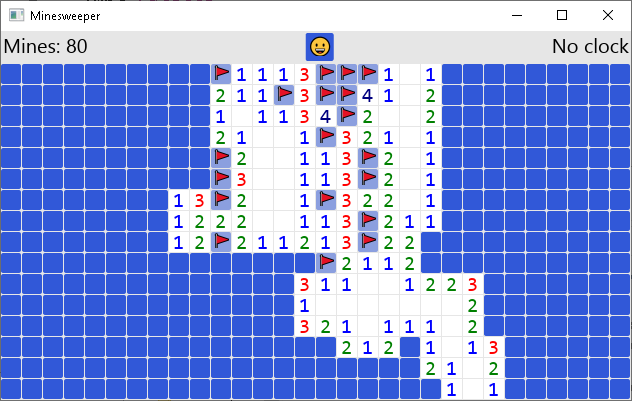

# minesweeper

Cross-compatible GUI Minesweeper game built with Iced

Run with:

    cargo run

Features:

* Randomly places mines, and writes numbers accordingly. Numbers are colored.
* Clicking a blank space recusively opens up the sides and corners.
* Detects if you won or lost the game, lets you restart the game.
* Right clicking a cell flags a bomb. There is a bomb counter.
* Middle click / double click reveals neighboring cells.

Missing Features:

* No clock
